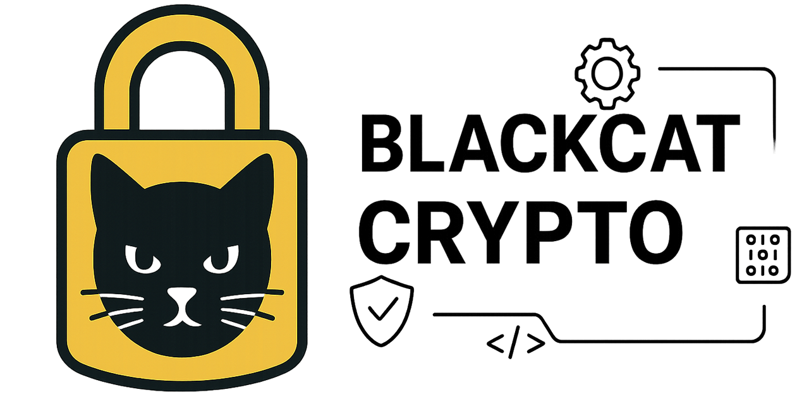

# BlackCat Crypto

[](https://github.com/blackcatacademy/blackcat-crypto/actions/workflows/ci.yml)

Centralized cryptography services for the BlackCat ecosystem: AEAD encryption, HMAC, KMS wrapping, and key rotation.

The goal is to keep crypto logic in one place, so other modules can depend on a single audited implementation and avoid handling raw keys directly.

## Features

- **Double-envelope encryption**: local AEAD + optional KMS wrapping.
- **Slot-based keying**: separate keys for each use case (AEAD/HMAC/etc), with versioned key files.
- **Rotation-safe HMAC**: multi-key verification + `keyId`/candidates for DB patterns.
- **KMS routing**: pluggable clients (HTTP/HSM), health reporting, suspend/resume.
- **Async rotation queue**: queue-backed rewrap via CLI (`wrap:queue`).
- **Zero-boilerplate bootstrap**: `PlatformBootstrap::boot()` wires env + optional bridges.

## Install

```bash
composer require blackcat/crypto
```

## Quick start (local keys)

```bash
export BLACKCAT_KEYS_DIR=./keys
export BLACKCAT_CRYPTO_MANIFEST=../blackcat-crypto-manifests/contexts/core.json

php bin/crypto manifest:validate "$BLACKCAT_CRYPTO_MANIFEST"
php bin/crypto key:rotate core.crypto.default "$BLACKCAT_KEYS_DIR" --manifest="$BLACKCAT_CRYPTO_MANIFEST"
php bin/crypto key:rotate core.hmac.email "$BLACKCAT_KEYS_DIR" --manifest="$BLACKCAT_CRYPTO_MANIFEST" --length=64

php bin/crypto keys:lint --manifest="$BLACKCAT_CRYPTO_MANIFEST" --keys-dir="$BLACKCAT_KEYS_DIR"
```

Then in PHP:

```php
use BlackCat\Crypto\Bootstrap\PlatformBootstrap;

$crypto = PlatformBootstrap::boot();

$envelope = $crypto->encryptContext('users.pii', $plaintext);
$plaintext = $crypto->decryptContext('users.pii', $envelope->encode());
```

## Database encryption (blackcat-database-crypto)

This repository intentionally contains **no database code**. For transparent DB encryption/HMAC on write paths (create/update/upsert) use:

- `blackcatacademy/blackcat-database`
- `blackcatacademy/blackcat-database-crypto`

With those packages installed, `PlatformBootstrap::boot()` can configure the DB ingress locator automatically.

```bash
export BLACKCAT_DB_ENCRYPTION_MAP=./config/encryption.json
export BLACKCAT_DB_ENCRYPTION_REQUIRED=1   # fail-closed (recommended)
export BLACKCAT_KEYS_DIR=./keys
export BLACKCAT_CRYPTO_MANIFEST=../blackcat-crypto-manifests/contexts/core.json
```

## CLI

```
php bin/crypto help
php bin/crypto key:rotate core.crypto.default keys/ --manifest=../blackcat-crypto-manifests/contexts/core.json
php bin/crypto keys:lint --manifest=../blackcat-crypto-manifests/contexts/core.json --keys-dir=./keys
php bin/crypto wrap:status storage/envelopes/123.json
php bin/crypto kms:diag
php bin/crypto wrap:queue status --limit 10
php bin/crypto wrap:queue run --limit 25 --dump-dir=/tmp/rewrap
php bin/crypto manifest:show --output=/tmp/manifest.json
php bin/crypto vault:diag storage/files/
php bin/crypto vault:migrate storage/files/foo.enc storage/files/foo.envelope
php bin/crypto vault:decrypt storage/files/foo.enc --output=/tmp/foo.txt
php bin/crypto metrics:export prom
php bin/crypto telemetry:sse --interval=5
php bin/crypto telemetry:intents --format=prom --limit=25
php bin/crypto kms:watchdog --interval=30
php bin/crypto kms:suspend hsm-primary 600
php bin/crypto kms:resume hsm-primary
php bin/crypto gov:assess --tenant=acme --sensitivity=low --amount=500
php bin/crypto vault:coverage var/ingress.ndjson --table --top=5
php bin/crypto manifest:validate ../blackcat-crypto-manifests/contexts/core.json --json
php bin/crypto key:rotate app.hsm keys/
```

Note: `key:generate` is deprecated and kept only as an alias for `key:rotate`.

## Core bridge (blackcat-core ↔ blackcat-crypto)

If `blackcat-core` is installed, legacy classes can delegate crypto to this package through `BlackCat\Crypto\Bridge\CoreCryptoBridge`.

## Shared manifests

The `blackcat-crypto-manifests` repo contains shared JSON manifests (`contexts/*.json`):

```bash
export BLACKCAT_CRYPTO_MANIFEST=../blackcat-crypto-manifests/contexts/core.json

# compare manifests (e.g. CI)
php bin/crypto manifest:diff --from=../blackcat-crypto-manifests/contexts/core.json --to=../env/prod/manifest.json --json
```

## Documentation

- `docs/INTEGRATION.md`
- `docs/EXAMPLES.md`
- `docs/TROUBLESHOOTING.md`
- `docs/ROADMAP.md`
- `docs/RELEASE_NOTES.md`

## Development

- Requirements: PHP 8.3+, ext-sodium, Composer.
- Install deps + dev tools: `composer install`
- Run tests: `composer test`
- Static analysis: `composer stan`
- Docker build (optional): `docker build -t blackcat-crypto .`
- Run tests in container:
  ```bash
  docker run --rm -v $(pwd):/app -w /app blackcat-crypto vendor/bin/phpunit
  ```
- Or via compose: `docker-compose run --rm crypto`
